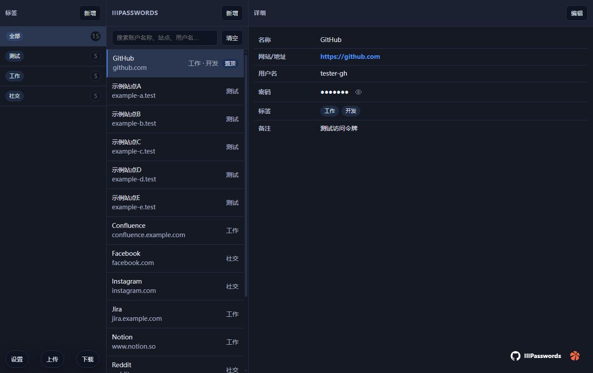
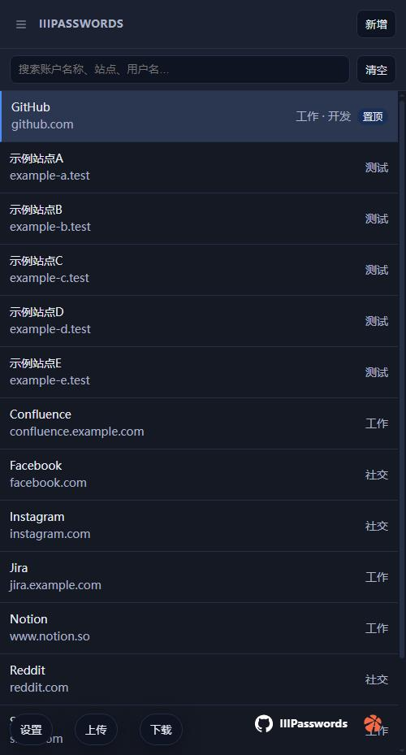
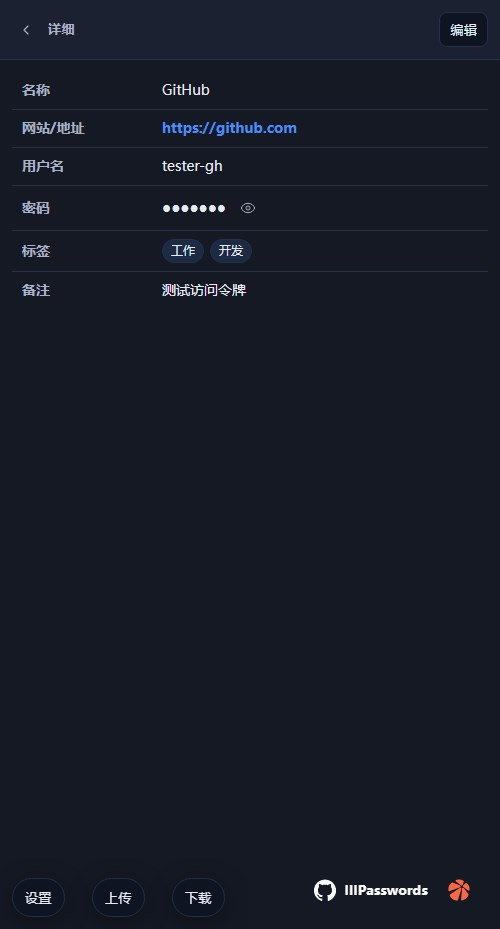

# 密码管理器（单页版）

一个纯前端的本地密码管理器，基于 `index.html` 单文件实现，数据保存在浏览器 `localStorage` 中，无需后端。

## 使用说明
1. passwords.json 为测试数据，可用于导入测试。密码是123
2. 小技巧，当在密码里面输入1-64位数字，可以直接生成对应长度的密码。

## 图片





## 功能概览

- 标签管理：创建、重命名、删除、置顶标签，拖拽排序
- 账户管理：新增、编辑、删除、置顶账户；支持按标签内拖拽排序
- 搜索过滤：按名称/站点/用户名实时过滤
- 详情查看：点击账户查看站点、用户名、密码、备注等
- 密码可见切换：详情页与编辑/新增弹窗均支持小眼睛显示/隐藏
- 随机密码生成：支持“字母+数字”或“含符号”两种生成方式，可输入数字指定长度（1-64）
- 导入/导出：
  - 导出普通 JSON（AES=no）
  - 导出 AES-GCM 加密 JSON（AES=yes，PBKDF2-SHA256 派生，支持盐与迭代次数）
  - 导入普通或加密 JSON（加密需输入密码）
- 置顶标记：账户可置顶，并在列表中优先显示
- 上下文菜单：右键账户/标签可进行置顶、编辑、删除等操作
- 移动端视图：标签/账户/详情三栏在小屏幕自动切换；提供“显示标签”和“返回”按钮
- 仅中栏滚动：当账户过多时，滚动条只出现在“账户列表”区域（样式为细线）

## 使用说明

1. 打开 `mima/index.html` 即可使用（双击或浏览器打开）。
2. 新增标签：
   - 左栏点击“新增”，输入标签名保存。
3. 新增账户：
   - 中栏“新增”，填写名称/站点/用户名/密码/备注，并选择标签；可使用随机密码按钮。
4. 搜索：
   - 中栏顶部输入框实时过滤账户。
5. 查看/编辑：
   - 点击账户查看详情；点击“编辑”在弹窗中修改。
6. 置顶与排序：
   - 右键账户选择“置顶/取消置顶”；
   - 在具体标签视图下，可拖拽账户改变排序。
7. 导出：
   - 右下角“下载”按钮导出。
   - 在“设置”中开启 AES 加密并设置密码后，可导出加密数据。
8. 导入：
   - 右下角“上传”按钮选择 JSON 导入；导入将覆盖当前数据。
   - 若文件为加密格式（`AES": "yes"`），会提示输入解密密码。
9. 测试数据：
   - 已提供 `mima/test-accounts.json`（15 条账户，分布“测试/社交/工作”）。
   - 导入步骤：点击“上传”→选择该文件→确认覆盖。

## 界面与滚动说明

- 布局为三栏：标签（左）、账户（中）、详情（右）。
- 仅“账户列表”区域可滚动：
  - `.app` 使用 `overflow:hidden`，`.panel` 使用 `min-height:0`；
  - `.accounts` 使用 `flex:1; min-height:0; overflow:auto`；
  - 滚动条样式（细线）仅在 `.accounts` 区域生效：
    - Firefox：`scrollbar-width: thin; scrollbar-color: var(--border) transparent`
    - WebKit：`::-webkit-scrollbar { width:4px }` 等
- 若仍出现浏览器右侧滚动，通常是弹窗/上下文菜单在特定状态下撑高页面，关闭后即可恢复；正常列表场景下滚动只在中栏出现。

## 设置与安全

- 设置入口：左下角“设置”悬浮按钮。
- AES 加密导出：
  - 算法：AES-GCM（12 字节随机 IV）
  - 密钥派生：PBKDF2-SHA256（默认 100000 次迭代，随机盐）
  - 加密字段：用户名与密码（其余元数据明文，便于标签/排序）
- 注意：这是纯前端本地应用，安全性依赖浏览器与本机环境。请勿在不可信设备上使用。

## 数据持久化与结构

- 所有数据保存在浏览器 `localStorage`：
  - `pm_data`: 业务数据（标签、账户、置顶、排序等）
  - `pm_ui`: UI 状态（选中的标签/账户）
  - `pm_settings`: 设置（AES 开关与密码）
- 导出普通 JSON结构示例：
  ```json
  {
    "AES": "no",
    "tags": [{ "tag": "社交", "accounts": [ { "id": "acc_xxx", "name": "Twitter", ... } ] }],
    "pinnedIds": ["acc_xxx"],
    "tagOrder": ["社交", "工作"],
    "accountOrderByTag": { "社交": ["acc_xxx", "acc_yyy"] }
  }
  ```

## 开发提示

- 单文件实现：所有样式与脚本在 `index.html` 内，便于拷贝与离线使用。
- 若要调整主题或滚动条样式，修改 `:root` 变量或 `.accounts` 相关 CSS。
- 布局栅格在 `.app`，三栏宽度在 `grid-template-columns` 中配置（含两处响应式断点）。

## 许可证

MIT License（推荐用于开源示例与个人/商业使用）。
完整许可证文本见本目录下的 `LICENSE` 文件。